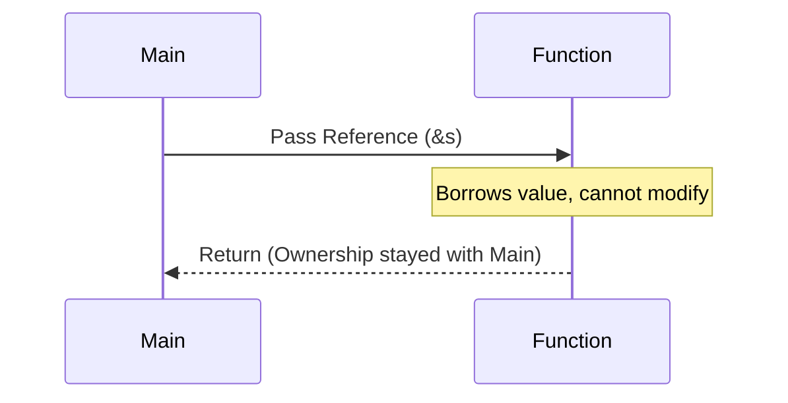

# Week 1: Rust Fundamentals & Memory Management

This week covers the building blocks of Rust, focusing on why Rust is unique: its approach to memory safety without a garbage collector.

## Core Concepts

### 1. Variables and Scalar Types
Rust is a statically typed language. We use `let` to declare variables. By default, variables are **immutable**.

- **Integer Types**: `u8`, `u32`, `i32`, etc. (e.g., `u32` is a 32-bit unsigned integer).
- **Mutability**: Use `mut` to make a variable changeable.
  ```rust
  let mut x: u32 = 10;
  x = 20; // Allowed because of 'mut'
  ```

### 2. Memory Management (Stack vs. Heap)
Rust manages memory through a system of ownership with a set of rules that the compiler checks at compile time.

- **Stack**: Fast, fixed size. Stores primitive types and pointers.
- **Heap**: Slower, dynamic size. Stores data where the size might change (like `String` or `Vec`).

### 3. Ownership
Ownership is Rust’s most unique feature. It ensures memory safety without a garbage collector.

#### Ownership Rules:
1. Each value in Rust has a variable that’s called its **owner**.
2. There can only be **one owner** at a time.
3. When the owner goes out of scope, the value will be **dropped** (memory cleared).

#### Move vs. Copy:
- **Copy**: Primitive types (like `i32`) that are stored on the stack are copied.
- **Move**: Complex types (like `String`) stored on the heap are *moved* when assigned to another variable.

```mermaid
graph TD
    subgraph Move Process
    A[let s1 = String::from('hello')] -->|s1 owns 'hello'| B(Memory on Heap)
    C[let s2 = s1] -->|Ownership moves to s2| B
    s1 -.->|Invalidated| D[Error if used]
    end
```

### 4. Borrowing & References
Instead of transferring ownership, you can **borrow** a value using references (`&`).

- **Immutable Borrowing**: `&T` - You can have multiple immutable references.
- **Mutable Borrowing**: `&mut T` - You can have only **one** mutable reference at a time.



## Learnings
- **Static Typing**: Understanding bits and bytes helps in choosing the right type like `u8` vs `u32`.
- **String vs &str**: `String` is owner of heap data; `&str` is a reference (slice) to string data.
- **Ownership solves Dangling Pointers**: By ensuring only one owner, Rust prevents accessing memory that has already been deallocated.

## Code Examples
- [Basic Types](file:///c:/Users/USER/Desktop/100xBootcamp/Rust/Week-1/rust_project/src/main.rs)
- [Ownership & Move](file:///c:/Users/USER/Desktop/100xBootcamp/Rust/Week-1/hello_cargo/src/main.rs)
