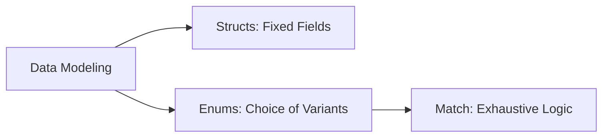
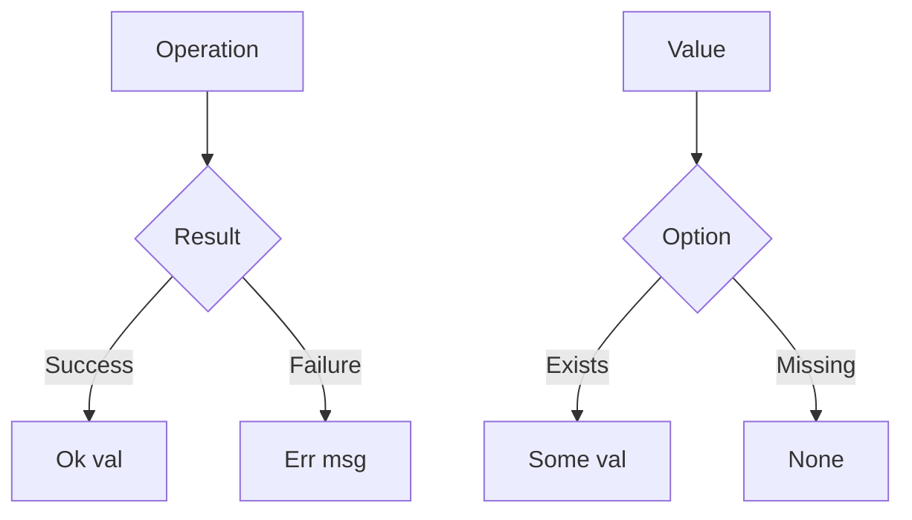

# Week 2: Structs, Enums, and Error Handling

This week explores how Rust models data using Structs and Enums, and how it handles errors safely without exceptions.

## Core Concepts

### 1. Structs
Structs are used to create custom data types by grouping related values.

- **Defining a Struct**:
  ```rust
  pub struct Rect {
      pub height: f32,
      pub width: f32
  }
  ```
- **Implementing Methods**: Use `impl` to define functions associated with the struct. `&self` is used for instance methods.
  ```rust
  impl Rect {
      pub fn area(&self) -> f32 {
          self.width * self.height
      }
  }
  ```

### 2. Enums and Pattern Matching
Enums allow you to define a type by enumerating its possible variants. In Rust, enums are "Algebraic Data Types" because variants can hold data.

- **Enum with Data**:
  ```rust
  enum Shape {
      Square(f32),
      Circle(f32),
      Rectangle(f32, f32)
  }
  ```
- **Pattern Matching**: The `match` operator is used to handle different enum variants exhaustively.
  ```rust
  match shape {
      Shape::Square(side) => side * side,
      Shape::Circle(radius) => std::f32::consts::PI * radius * radius,
      _ => 0.0
  }
  ```



### 3. Error Handling
Rust avoids `null` and `exceptions`. Instead, it uses enums to represent the possibility of absence or failure.

- **Option<T>**: Used for a value that might be `None` or `Some(T)`. Resolves the "Billion Dollar Mistake" of null pointers.
- **Result<T, E>**: Used for operations that can succeed (`Ok(T)`) or fail (`Err(E)`).



## Learnings
- **Static vs Instance Methods**: Functions in `impl` without `&self` are like static methods (called with `Rect::print_something()`).
- **Exhaustiveness**: The compiler forces you to handle every case in a `match`, reducing bugs.
- **Safe I/O**: Operations like `fs::read_to_string` return a `Result`, forcing error handling.

## Code Examples
- [Struct Implementations](file:///c:/Users/USER/Desktop/100xBootcamp/Rust/Week-2/new/src/structs/rectangle.rs)
- [Enums & Pattern Matching](file:///c:/Users/USER/Desktop/100xBootcamp/Rust/Week-2/new/src/enums/main.rs)
- [Option & Result Error Handling](file:///c:/Users/USER/Desktop/100xBootcamp/Rust/Week-2/new/src/error_handling/main.rs)
