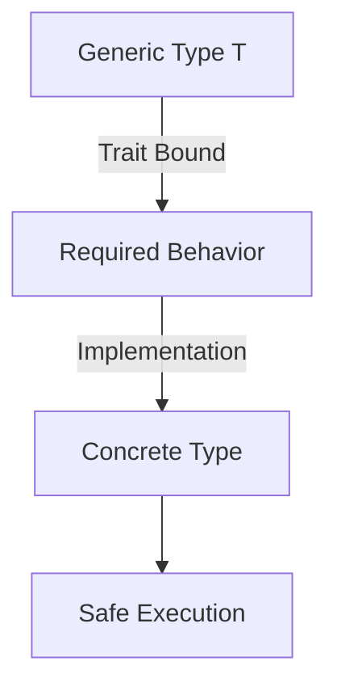
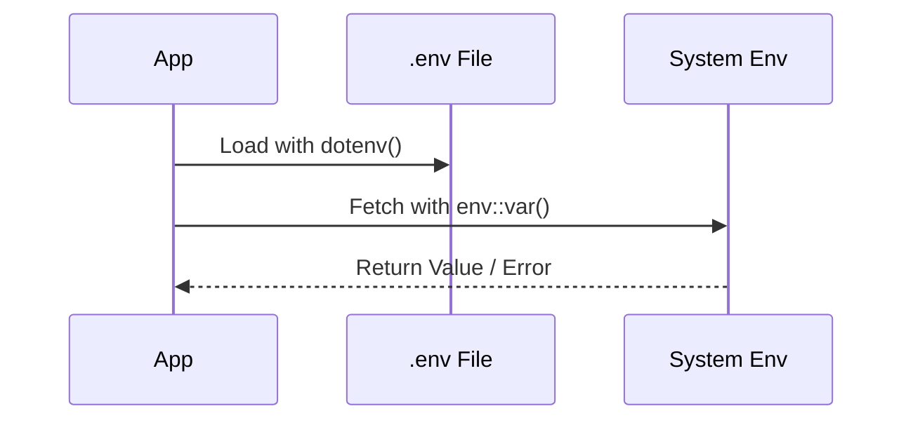

# Week 3: Generics, Traits, and Environment Handling

This week covers advanced Rust features that allow for code reuse and modularity, as well as handling external environment variables and time.

## Core Concepts

### 1. Generics
Generics allow you to write code that can work with multiple types, reducing code duplication.

- **Generic Functions**: Use `<T>` to define a type parameter.
  ```rust
  fn sum<W: Add<Output = W>>(a: W, b: W) -> W {
      a + b
  }
  ```

### 2. Traits and Trait Bounds
Traits define shared behavior. Trait bounds (`: Trait`) restrict a generic type to only those that implement a specific trait.

- **Example**: In the `sum` function above, `W: Add<Output = W>` is a trait bound ensuring that the type `W` supports the addition operation.



### 3. Environment and Utilities
Working with external factors like time and environment variables is crucial for real-world apps.

- **Chrono**: A library for time management (`Utc::now()`, `Local::now()`).
- **Dotenv**: Loading environment variables from a `.env` file using `dotenv().ok()`.
- **Envs**: Accessing variables via `env::var("VAR_NAME")`.



## Learnings
- **Flexibility**: Generics make functions like `sum` work for `i32`, `f32`, and any other type that implements `Add`.
- **Explicit Failure**: Using `.unwrap()` on environment variables is common in simple scripts but can cause panics if the variable is missing.
- **External Crates**: Chrono and Dotenv show how to extend Rust's capabilities using the ecosystem.

## Code Examples
- [Generics & Trait Bounds](file:///c:/Users/USER/Desktop/100xBootcamp/Rust/Week-3/src/generics.rs)
- [Environment & Time](file:///c:/Users/USER/Desktop/100xBootcamp/Rust/Week-3/src/main.rs)
